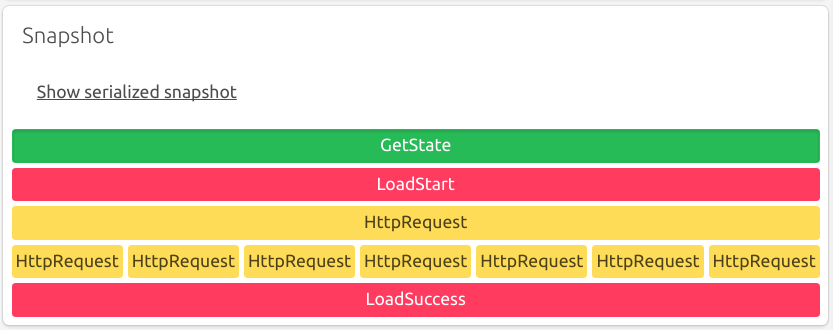
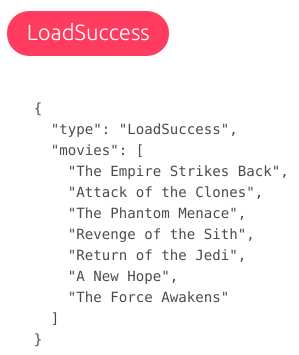
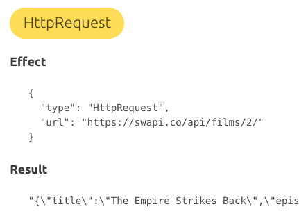

#  Redux Ship
> Side effects with snapshots for Redux.

[](https://travis-ci.org/clarus/redux-ship)
[](https://ci.appveyor.com/project/clarus/redux-ship)
[](https://www.npmjs.com/package/redux-ship)
[](https://www.npmjs.com/package/redux-ship)

Redux Ship is a side effects handler for [Redux](https://github.com/reactjs/redux) with a built-in system of **snapshots** for:

* **live debugging** thanks to a graphical visualization of the side effects;
* simpler **unit tests** with snapshot testing.

The key insight is to use generators to serialize all the side effects, including the control flow of the code, using the approach of *free monads*. Additionally, we provide a **composition mechanism** of sub-stores with effects and **full typing** (for now only in [Flow](https://flow.org/)).

## Install
```
npm install --save redux-ship
```

## Documentation
* [Tutorial](https://clarus.github.io/redux-ship/docs/tutorial/)
* [API Reference](https://clarus.github.io/redux-ship/docs/api.html)

## Example
Get the movies of R2D2 using the [StarWars API](https://swapi.co/):
```js
// Check if we already have the list of movies in the Redux store.
const currentMovies = yield* Ship.getState(state => state.movies);
if (!currentMovies) {
  // If not, notify Redux that we start loading the movies.
  yield* Ship.commit({type: 'LoadStart'});
  // Get the description of R2D2 with an API call.
  const r2d2 = yield* Effect.httpRequest('https://swapi.co/api/people/3/');
  // For each movie of R2D2:
  const movies = yield* Ship.all(JSON.parse(r2d2).films.map(function* (movieUrl) {
    // Get the movie title with an API call.
    const movie = yield* Effect.httpRequest(movieUrl);
    return JSON.parse(movie).title;
  }));
  // Write the list of movies in the Redux store.
  yield* Ship.commit({type: 'LoadSuccess', movies});
}
```

With the [Redux Ship devtools](https://github.com/clarus/redux-ship-devtools) we see the following snapshot of the execution:


This shows us that we:

* access the Redux state;
* dispatch the action `LoadStart`;
* make an HTTP call;
* make seven HTTP calls in parallel (to get the movie titles);
* dispatch the action `LoadSuccess`.

Even without reading the code we get a sense of what the application does. By clicking on each pill we see the details of each element.

* access to a value in the store:


* dispatch of an action to the store:



* other side effect like an API call with the effect and its result:



We also get a serialized snapshot, directly usable to make a unit test:
```js
[
  {
    "type": "GetState",
    "state": null
  },
  {
    "type": "Commit",
    "commit": {
      "type": "LoadStart"
    }
  },
  {
    "type": "Effect",
    "effect": {
      "type": "HttpRequest",
      "url": "https://swapi.co/api/people/3/"
    },
    "result": "{\"name\":\"R2-D2\",\"height\":\"96\",\"mass\":\"32\",\"hair_color\":\"n/a\",\"skin_color\":\"white, blue\",\"eye_color\":\"red\",\"birth_year\":\"33BBY\",\"gender\":\"n/a\",\"homeworld\":\"https://swapi.co/api/planets/8/\",\"films\":[\"https://swapi.co/api/films/2/\",\"https://swapi.co/api/films/5/\",\"https://swapi.co/api/films/4/\",\"https://swapi.co/api/films/6/\",\"https://swapi.co/api/films/3/\",\"https://swapi.co/api/films/1/\",\"https://swapi.co/api/films/7/\"],\"species\":[\"https://swapi.co/api/species/2/\"],\"vehicles\":[],\"starships\":[],\"created\":\"2014-12-10T15:11:50.376000Z\",\"edited\":\"2014-12-20T21:17:50.311000Z\",\"url\":\"https://swapi.co/api/people/3/\"}"
  },
  {
    "type": "All",
    "snapshots": [
      [
        {
          "type": "Effect",
          "effect": {
            "type": "HttpRequest",
            "url": "https://swapi.co/api/films/2/"
          },
          "result": "{\"title\":\"The Empire Strikes Back\",\"episode_id\":5,\"opening_crawl\":\"It is a dark time for the\\r\\nRebellion. Although the Death\\r\\nStar has been destroyed,\\r\\nImperial troops have driven the\\r\\nRebel forces from their hidden\\r\\nbase and pursued them across\\r\\nthe galaxy.\\r\\n\\r\\nEvading the dreaded Imperial\\r\\nStarfleet, a group of freedom\\r\\nfighters led by Luke Skywalker\\r\\nhas established a new secret\\r\\nbase on the remote ice world\\r\\nof Hoth.\\r\\n\\r\\nThe evil lord Darth Vader,\\r\\nobsessed with finding young\\r\\nSkywalker, has dispatched\\r\\nthousands of remote probes into\\r\\nthe far reaches of space....\",\"director\":\"Irvin Kershner\",\"producer\":\"Gary Kurtz, Rick McCallum\",\"release_date\":\"1980-05-17\",\"characters\":[\"https://swapi.co/api/people/1/\",\"https://swapi.co/api/people/2/\",\"https://swapi.co/api/people/3/\",\"https://swapi.co/api/people/4/\",\"https://swapi.co/api/people/5/\",\"https://swapi.co/api/people/10/\",\"https://swapi.co/api/people/13/\",\"https://swapi.co/api/people/14/\",\"https://swapi.co/api/people/18/\",\"https://swapi.co/api/people/20/\",\"https://swapi.co/api/people/21/\",\"https://swapi.co/api/people/22/\",\"https://swapi.co/api/people/23/\",\"https://swapi.co/api/people/24/\",\"https://swapi.co/api/people/25/\",\"https://swapi.co/api/people/26/\"],\"planets\":[\"https://swapi.co/api/planets/4/\",\"https://swapi.co/api/planets/5/\",\"https://swapi.co/api/planets/6/\",\"https://swapi.co/api/planets/27/\"],\"starships\":[\"https://swapi.co/api/starships/15/\",\"https://swapi.co/api/starships/10/\",\"https://swapi.co/api/starships/11/\",\"https://swapi.co/api/starships/12/\",\"https://swapi.co/api/starships/21/\",\"https://swapi.co/api/starships/22/\",\"https://swapi.co/api/starships/23/\",\"https://swapi.co/api/starships/3/\",\"https://swapi.co/api/starships/17/\"],\"vehicles\":[\"https://swapi.co/api/vehicles/8/\",\"https://swapi.co/api/vehicles/14/\",\"https://swapi.co/api/vehicles/16/\",\"https://swapi.co/api/vehicles/18/\",\"https://swapi.co/api/vehicles/19/\",\"https://swapi.co/api/vehicles/20/\"],\"species\":[\"https://swapi.co/api/species/6/\",\"https://swapi.co/api/species/7/\",\"https://swapi.co/api/species/3/\",\"https://swapi.co/api/species/2/\",\"https://swapi.co/api/species/1/\"],\"created\":\"2014-12-12T11:26:24.656000Z\",\"edited\":\"2017-04-19T10:57:29.544256Z\",\"url\":\"https://swapi.co/api/films/2/\"}"
        }
      ],
      [
        {
          "type": "Effect",
          "effect": {
            "type": "HttpRequest",
            "url": "https://swapi.co/api/films/7/"
          },
          "result": "{\"title\":\"The Force Awakens\",\"episode_id\":7,\"opening_crawl\":\"Luke Skywalker has vanished.\\r\\nIn his absence, the sinister\\r\\nFIRST ORDER has risen from\\r\\nthe ashes of the Empire\\r\\nand will not rest until\\r\\nSkywalker, the last Jedi,\\r\\nhas been destroyed.\\r\\n \\r\\nWith the support of the\\r\\nREPUBLIC, General Leia Organa\\r\\nleads a brave RESISTANCE.\\r\\nShe is desperate to find her\\r\\nbrother Luke and gain his\\r\\nhelp in restoring peace and\\r\\njustice to the galaxy.\\r\\n \\r\\nLeia has sent her most daring\\r\\npilot on a secret mission\\r\\nto Jakku, where an old ally\\r\\nhas discovered a clue to\\r\\nLuke's whereabouts....\",\"director\":\"J. J. Abrams\",\"producer\":\"Kathleen Kennedy, J. J. Abrams, Bryan Burk\",\"release_date\":\"2015-12-11\",\"characters\":[\"https://swapi.co/api/people/1/\",\"https://swapi.co/api/people/3/\",\"https://swapi.co/api/people/5/\",\"https://swapi.co/api/people/13/\",\"https://swapi.co/api/people/14/\",\"https://swapi.co/api/people/27/\",\"https://swapi.co/api/people/84/\",\"https://swapi.co/api/people/85/\",\"https://swapi.co/api/people/86/\",\"https://swapi.co/api/people/87/\",\"https://swapi.co/api/people/88/\"],\"planets\":[\"https://swapi.co/api/planets/61/\"],\"starships\":[\"https://swapi.co/api/starships/77/\",\"https://swapi.co/api/starships/10/\"],\"vehicles\":[],\"species\":[\"https://swapi.co/api/species/3/\",\"https://swapi.co/api/species/2/\",\"https://swapi.co/api/species/1/\"],\"created\":\"2015-04-17T06:51:30.504780Z\",\"edited\":\"2015-12-17T14:31:47.617768Z\",\"url\":\"https://swapi.co/api/films/7/\"}"
        }
      ],
      [...] // other API calls
    ]
  },
  {
    "type": "Commit",
    "commit": {
      "type": "LoadSuccess",
      "movies": [
        "The Empire Strikes Back",
        "Attack of the Clones",
        "The Phantom Menace",
        "Revenge of the Sith",
        "Return of the Jedi",
        "A New Hope",
        "The Force Awakens"
      ]
    }
  }
]
```

## License
MIT
